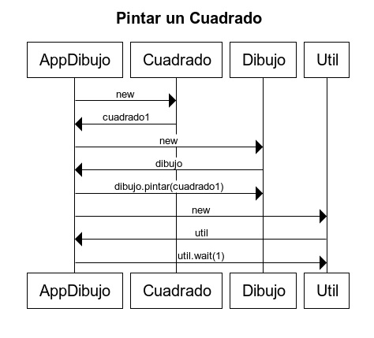
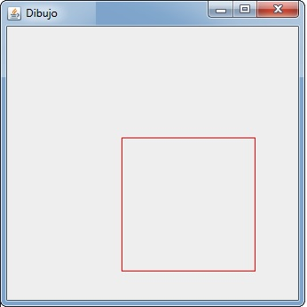

## Práctica 01. POO básico. Dibujo de un cuadrado. 
### Desarrollo de una clase básica en un entorno gráfico.

#### Introducción 
Ésta es la primera práctica de un conjunto de ellas en las que desarrollaremos un proyecto que nos llevará todo el curso, cuyo objetivo final será programar  una aplicación de dibujo, tipo Paint. 

Empezaremos por lo básico (desarrollo del objeto Cuadrado) y la ampliaremos mediante iteraciones plasmando los nuevos conceptos adquiridos en la asignatura hasta conseguir una aplicación de dibujo gráfico completamente funcional.

#### Primera práctica
Se debe implementar una clase que defina el comportamiento de un objeto Cuadrado para ser pintado en un dibujo, para ello os tenéis que apoyar en las clases que os suministro (Dibujo, Lienzo y Util) para poder realizar el programa. 

Con las clases Dibujo y Util no tenéis que hacer nada más que lanzar los mensajes necesarios sobre su interfaz para encontrar la funcionalidad que se pide. La clase Lienzo sólo está de apoyo de Dibujo, no debéis utilizarla.

El cuadrado deberá posicionarse en un punto dado del dibujo (coordenadas x e y) y tendrá un tamaño determinado (lado).

Decidir el mejor constructor para este objeto.

Para pintar el cuadrado en un entorno gráfico (Dibujo) se utilizarán las clases suministradas por el profesor. Se podrá analizar el código (¿Cómo lo hace?) o la documentación facilitada de la carpeta docs (¿Qué hace?). ¿Qué os resulta más sencillo?



##### Se pide
1. Implementar las clases Cuadrado, AppDibujo01 y AppDibujo02.

Se debe tener en cuenta que se deben compilar todas las clases exisrentes, las proporcionadas por el profesor y las creadas por el alumno. Por lo general, compilando la clase App se deberían compilar todas clases vinculadas, pero si en algún caso no fuera así, forzaremos la compilación de todas ellas con el comando:
```
javac *.java
```

##### Forma de realizar la práctica
1. Debéis descargaros las clases que se suministran (si no se está trabajando con Git Desktop se puede entrar en cada clase y acceder a la versión RAW, botón arriba a la derecha del código).
2. Copiarlas al mismo directorio en el que vayamos a realizar la práctica.
3. Crear un objeto/instancia/ocurrencia de Dibujo para generar la ventana gráfica.
4. Interactuar con este objeto creado para pintar el cuadrado/s solicitados.

##### Salida del programa
* AppDibujo01: Crear un cuadrado, pintarlo y esperar un segundo. Repetir esta acción hasta pintar tres cuadrados diferentes. 
* AppDibujo02: Crear un cuadrado y pintarlo. Esperar un segundo y moverlo a una nueva posición. Esperar otro segundo y volver a moverlo a otra posición del dibujo. Por último, cambiar su tamaño después de esperar un segundo.
* AppDibujo03: Como se ha hecho en AppDibujo01, pintar 3 cuadrados pero esta vez con x, y & lado totalmente aleatorios. Para ello usar la clase Random y el método "nextInt". https://docs.oracle.com/javase/8/docs/api/java/util/Random.html#nextInt--

Nótese que el programa sólo es capaz de pintar un cuadrado de forma simultánea. No se pueden mostrar los tres a la vez.




