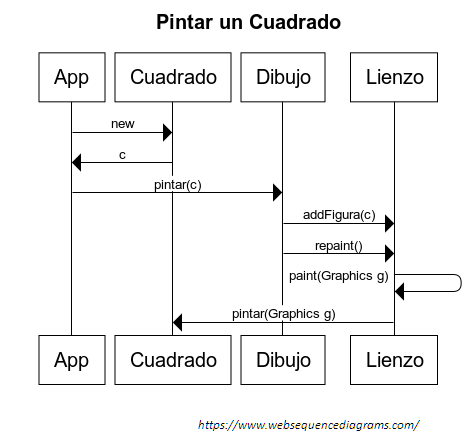

## Práctica 03p2. POO avanzado. Dibujo de diferentes tipos de figura. 
### Desarrollo de una aplicación gráfica que dibuje varios tipos de figuras basándose en el concepto de herencia.

Fusionar las prácticas 2 (pintar en un dibujo un cuadrado) y 3p1 (figuras en herencia) para que podamos representar cuadrados y circunferencias en un lienzo. Esta fusión deberá cambiar la forma de pintar los cuadrados de las primeras prácticas. En la práctica 2 la lógica propia de pintar el cuadrado, no la tenía el propio objeto, si no la tenía el Dibujo. Esto va en contra de la filosofía del patrón Experto: cada objeto debe ser el que posea toda su lógica.

A continuación, se muestra un diagrama de secuencia que ayudará a saber el flujo de programa de nuestro código:

Como ya programamos en la práctica 3, cada figura podrá tener relleno o no y poseerán un color específico, además de tener una posición.

Se investigará en la API del JDK la forma de pintar rectángulos y círculos con y sin relleno (https://docs.oracle.com/javase/9/docs/api/java/awt/Graphics.html).

##### Salida del programa

* AppDibujo01: Crear dos círculos rellenos, un cuadrado relleno y otro sin relleno.

* AppDibujo02: Crear 10 cuadrados que se vayan pintando con un intervalo de 1 segundo desplazándose en forma diagonal (de arriba a la izquierda hacia abajo a la derecha).

* AppDibujo03: Crear 4 triángulos equilateros (revisad un poco la trigonometría, podéis usar la clase Math). Estos triángulos pueden estar rellenos o no, así como su posición y lado también tendrá que ser aleatorios.

