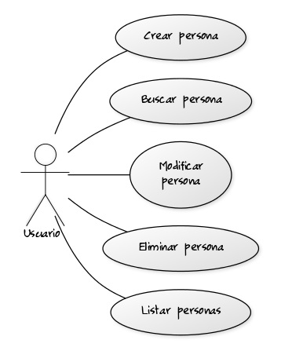
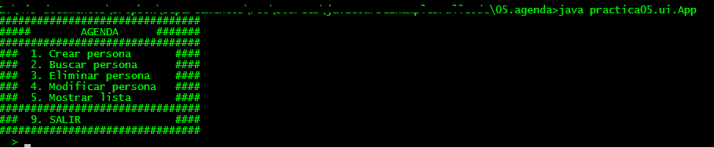

## Práctica 04. Java Básico. Interfaz del objeto: equals() y toString()
### Crear una agenda que gestione personas.

#### Funcionalidad

Desarrollar un programa Java de consola (no gráfico) que muestre un menú al usuario proporcionando un conjunto de opciones. La opción introducida por el usuario se leerá por teclado gracias a la clase que se proporciona: Leer (copiar al directorio de la práctica).

Las opciones que se mostrarán al usuario para trabajar con la agenda, serán:

1. Crear ocurrencias de la clase Persona introduciendo la información por teclado. Posteriormente, se insertarán dichas ocurrencias en un array.
2. Buscar personas en dicho array, devolviendo la posición que ocupa. Para ello se pedirá la información necesaria para utilizar el método *public boolean equals(Object o)* declarado en Object. En este caso, dos persona serán iguales cuando coincida su DNI. Se deberá delegar en la clase Persona y que ella decida cuando dos objetos son iguales.
3. Eliminar una persona. Para esta acción, se reutilizará el código codificado en el punto anterior para localizar a los objetos.
4. Modificar una persona concreata. Las forma de modificar una persona será modificando los valores de sus atributos, no reemplazando el objeto por otro.
5. Mostrar el contenido del array. El número máximo de ocurrencias a crear será 10.

##### Diagrama de Casos de Uso

##### Output

#### Diseño

- Se deberá diseñar el programa de tal manera que el App (el interfaz de usuario, UI) esté separado de la lógica de objetos.
- La gestión de los objetos Persona, se realiazará en una clase de agregación llamada Agenda. Toda la funcionalidad a realizar sobre las personas no se programará en el App, estará programado en Agenda.
- Si el día de mañana cambia este UI por otro, no debería afectar a la lógica de los objetos.

### Ayuda

El método porTeclado() de la clase Leer devuelve siempre un String. 
Ver la Clase Integer para convertir este String a un int.
