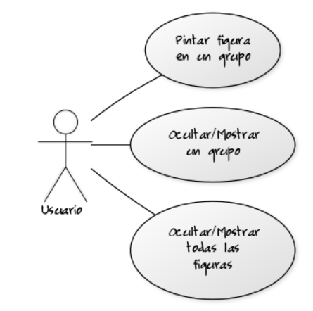
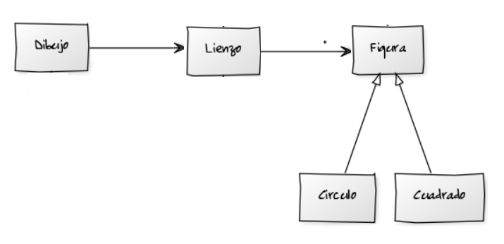
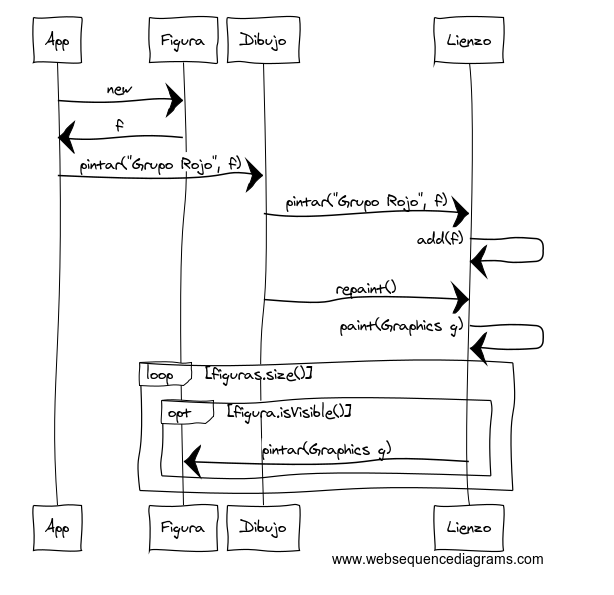

## Práctica 07. POO avanzado. Dibujo de diferentes tipos de figura. 
### Desarrollo de una aplicación gráfica que dibuje varios tipos de figuras agrupadas, para poder ocultar y mostrar los grupos de forma automática.

Modificar la práctica de Dibujo para que agrupe distintas figuras. El grupo permitirá trabajar con un conjunto de figuras para realizar acciones conjuntas del tipo: mostrar figuras y ocultar figuras del grupo.

Esta práctica trabajará con paquetes.

##### Diagrama de Casos de uso



La gestión del grupo se realizará con una estructura que permita de un forma muy rápida acceder a un conjunto de figuras a partir de un nombre de grupo. Así se podrá gestionar fácil y eficientemente la acción de "ocultarGrupo".

##### Diagrama de Clases



Ahora, cuando se vaya a pintar una figura se deberá indicar a qué grupo pertenece:

```
dibujo.pintar("Grupo Rojo", new Circulo(100, 20, true, Color.RED, 200));
```

##### Diagrama de Secuencia del caso de uso "Pintar una Figura en un grupo"



#### Requisitos del programa

No será necesario programar la solución mediante programación funcional, debido a la complejidad que ello implicará. En primera instancia se programará:
- Tipificando colecciones.
```java
HashMap<String, Integer> mapa = new HashMap<>();
```
- Iterando con estructuras de control forEach:
```java
for(Persona p:personas)
```

#### Salida del programa
* AppDibujoGrupo: Crear 5 figuras que pertenezcan a 3 grupos diferentes. Haremos que las figuras de un grupo sean del mismo color, para comprender más fácilmente su ejecución. Así, los nombres de los grupos serán "Grupo Rojo", "Grupo Azul", etc.

En primer lugar se pintarán todas las figuras y con retardos de 1 segundo se ocutarán progresivamente cada uno de los grupos. 

```
dibujo.ocultarGrupo("Grupo Azul");
```


Cuando se hayan ocultado todos los grupos, se mostrarán todas las figuras.


