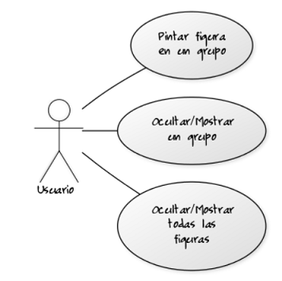
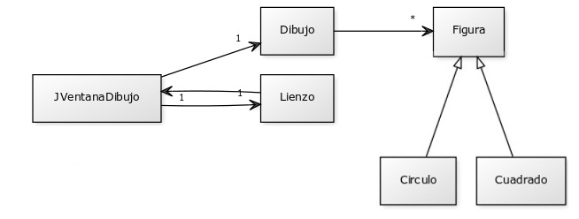
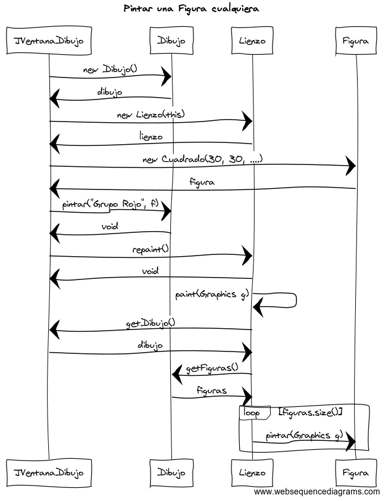
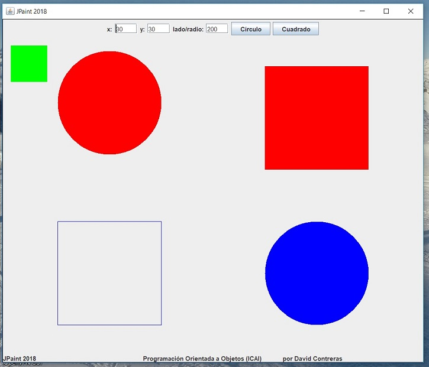

## Práctica 08.1. Java avanzado. JPaint: Aplicación gráfica de dibujo.
### Desarrollo de una aplicación gráfica que posea un interfaz preparado para dibujar futuros objetos tipo figura.

Modificar la práctica de Dibujo anterior para crear una aplicación gráfica que contenga los elementos que se muestran en el pantallazo que se adjunta.

Como no se podrán representar todavía figuras de forma interactiva a través de este interfaz gráfico, se tomará la forma de creación de figuras de la práctica anterior (mediante mensajes escritos en tiempo de compilación), pero dentro de la nueva clase JVentanaDibujo, que sustituirá a la antigua clase Dibujo. La clase App desaparecerá, ya que el main y el control del programa estará en el JFrame (nueva clase JVentanaDibujo). Ver el diagrama de clases para saber la nueva estructura y relación de clases que tendremos. La nueva clase Dibujo poseerá toda la lógica de gestión de nuestras figuras (como hacía la clase Agenda) que antes se guardaba en Lienzo.

La comunicación de los objetos variará en esta práctica. Observad la nueva comunicación que existirá mediante el diagrama de secuencia que se acompaña y el papel que juega la nueva clase gestora de figuras, Dibujo.

##### Salida del programa
* AppDibujoGrupoVentana: La aplicación tendrá la apariencia que se muestra:

