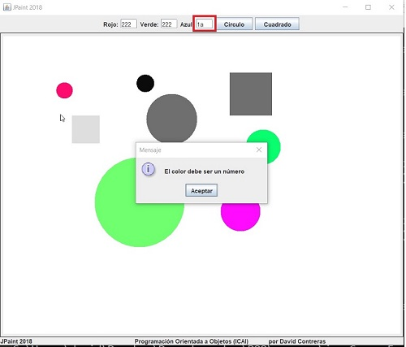
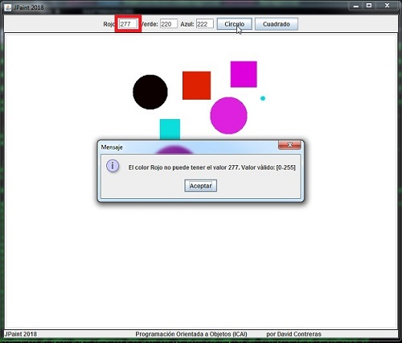

## Práctica 10. Java Avanzado. Eventos MouseListener y Excepciones.
### Personalización de los colores de nuestros objetos

#### Funcionalidad

Tomar como base la práctica anterior de la aplicación de dibujo y añadir los eventos necesarios para pintar las figuras con eventos de tipo ratón, así como los botones de circulo o cuadrado (se puede utilizar el botón de tipo JToogleButton o un JRadioButton)

Incluir las cajas de texto necesarias para que se pueda especificar el color de las figuras según la combinación de colores RGB. Por ello, existirá una caja de texto para el rojo, otra para el verde y otras para el azul.

En el caso de introducir un valor no válido para cada color primario (0-255) se lanzará una excepción propia que se creará el alumno, mostrando un mensaje mediante una ventana de diálogo (JOptionPane). Si se introduce un texto que no representa un número, también se deberá comunicar el error al usuario.

Para aumentar la usabilidad de la aplicación, se generarán tres números aleatorios para asignar automáticamente los colores al iniciar el programa y cada vez que se pinte un objeto.

Error en el caso de color no numérico:



Error en el caso de color no válido, fuera de [0-255]:



#### Diseño 

Las dos excepciones que se lanzarán, tanto la NumberFormatException en la conversión de String a int, como la nueva excepción a tratar (RGBConversionException), en la validación del rango [0, 255], se tratarán y gestionarán conjuntamente dentro del mismo try/catch.

La validación de rango y la conversion de los tres valores enteros a una ocurrencia de Color, se implementará en una nueva clase Util con el método siguiente:
```
public static Color rgbToColor(int r, int g, int b) throws RGBConversionException
```

#### UX

La implementación de este programa variará en función del momento que se desee realizar la comprobación del error y por lo tanto, de la experiencia de usuario que se desee proporcionar. Cuanto más tarde se haga la comprobación, más sencilla será la implementación, pero más pobre será el UX y viceversa. 

Así, la comprobación del error se podría hacer:
1. Justo al teclear el valor. (Mayor UX, más complejo)
2. Al perder el foco de la caja de texto.
3. **Al pulsar en el botón que identifique la figura a pintar.**
4. Al hacer el primer click de inicio del pintado.
5. Al hacer el segundo click de finalización del pintado. (Menor UX, más sencillo)

En esta práctica se recomienda hacer la comprobación en el punto 3.


<small>Nota: aunque la propia clase Color ya lanza una excepción IllegalArgumentException cuando ocurre este tipo de validaciones, lo hemos desarrollado nuevamente para poner en práctica este concepto.</small>
