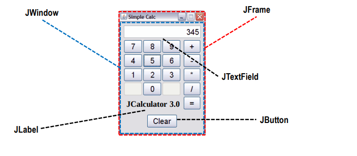

# AWT (Abstract Window Toolkit)
- Es una biblioteca de clases Java para el desarrollo de Interfaces de Usuario Gráficas. 
- Tiene el problema que fue de las primeras clases que se desarrollaron y tienen mucho código nativo de plataforma.
- Su evolución fue Swing
- Muchos componentes AWT son redefinidos por los nuevos Swing. (Button -> JButton)
- Pero otros elementos AWT todavía existen y conviven con los de Swing.

- Principales clases

# Componentes de toda aplicación GUI
1. Contenedores (Containers): Elementos que se emplean para colocar componentes en la ventana. La forma en la que se
distribuyan estos objetos en el container, dependerá del **Layout** que se aplique al mismo. Un container que no posea un layout, sólo podrá colocar un componente sobre sí mismo. Tipos de container:
  - Ventanas: Elemento donde se muestra cualquier contenido visual.
  - Paneles: Una ventana podrá contener tantos paneles como le permita el layout. Un panel, a su vez, deberá aplicar un layout para agregar componentes.

2. LayoutManager
- Indican la forma de organizar los componentes dentro del **container**. 
- Determinan el tamaño y posición de los componentes.
- CONTAINER -> Setear tipo de LayoutManager -> Agregar los componentes al container.
- Tipos de Layout Manager más importantes (todos elllos heredan del interface LayoutManager):
    • FlowLayout
    • BorderLayout
    • GridLayout
    • BoxLayout
    • CardLayout

3. Principales ventanas
La clase Window permite crear ventanas cualquier tipo. Las principales clases son:
- Frame: es la típica ventana de aplicación.
- Dialog: es la ventana que utilizan los cuadros de diálogo.
- Window: es una ventana sin marco ni barra de título. Utlizada para las ventanas de presentación.
- Métodos:
    - void setVisible (boolean visible)
    - void pack()
    - void setSize (int width, int height)
    - void setTitle (String title)
    - void setMenuBar (MenuBar mb)
    - void setResizable (boolean resizable)
    - void setState (int state)

